# 👋 Hi there, I'm Seokhyun Wie - aka Brandon

> Stack the credentials, build the future.

## 🧑🏻‍💻 Who Am I

- **A father and a loving husband**
- **A life-long learner** and a self-taught developer who started the journey on May 2, 2019
- **A product engineer (co-lead backend)** at [**Moba**](https://moba.works) building [**the Arch Calendar**](https://archcalendar.com), processing 6M+ calendar events across Google & Apple Calendar
- Pursuing [**Georgia Tech OMSCS (AI Track)**](https://omscs.gatech.edu/) for Spring 2027
- Space travel is my ultimate dream

[][linkedin] [][blog]

## 🥅 Goals for 2026

**Academic** — Georgia Tech OMSCS Prerequisites via edX (DSA, Linear Algebra, Probability, Networking), MIT Discrete Math, TOEFL iBT 90+, apply to OMSCS (Spring 2027)

**Certifications** — AWS AI Practitioner, Developer Associate, Solutions Architect Associate, Claude Certified Architect (Foundations)

**Professional** — Ship AI features at Moba (RAG, semantic search)

---

## 🛠️ Tech Stack

**Current:**

     
   
 

**Past:**

       

## 📜 Certifications

**Completed:**

-  **AWS Certified Cloud Practitioner** (Sep 2025)
-  **Introductory C Programming Specialization** — Duke University (Dec 2024)
-  **Nand to Tetris Part I & II** — Hebrew University of Jerusalem (Jan–Feb 2021)
-  **Machine Learning** — Stanford University, Andrew Ng (Dec 2020)
-  **Object-Oriented Programming in Java Specialization** — Duke University (Nov 2020)

**In Progress:**

-  **Georgia Tech OMSCS Prerequisites** (DSA, Linear Algebra, Probability)
-  **Claude Certified Architect — Foundations**

---

## 🌐 Open Source

I actively contribute fixes to tools I use — when I find a bug, I diagnose it and submit a PR rather than working around it.

**Merged PRs:**

| Project | PR | What |
| ------- | -- | ---- |
| [jarrodwatts/claude-hud](https://github.com/jarrodwatts/claude-hud) | [#203](https://github.com/jarrodwatts/claude-hud/pull/203) | Fixed zero-byte lock file causing permanent HUD failure |
| [TypeCellOS/BlockNote](https://github.com/TypeCellOS/BlockNote) | [#1589](https://github.com/TypeCellOS/BlockNote/pull/1589) | Docs fix: corrected Styles type definition |

**Issues filed:**

| Project | Issue | What |
| ------- | ----- | ---- |
| [microsoft/vscode](https://github.com/microsoft/vscode) | [#166927](https://github.com/microsoft/vscode/issues/166927) | InlayHints cursor horizontal movement inconsistency |
| [microsoft/vscode](https://github.com/microsoft/vscode) | [#140195](https://github.com/microsoft/vscode/issues/140195) | InlayHints blocking cursor vertical movement |
| [jarrodwatts/claude-hud](https://github.com/jarrodwatts/claude-hud) | [#202](https://github.com/jarrodwatts/claude-hud/issues/202) | 0-byte lock causes permanent busy state |
| [sfsam/Itsycal](https://github.com/sfsam/Itsycal) | [#164](https://github.com/sfsam/Itsycal/issues/164) | Calendar not appearing in Privacy preferences |
| [westerlind/alfred-raindrop-search](https://github.com/westerlind/alfred-raindrop-search) | [#30](https://github.com/westerlind/alfred-raindrop-search/issues/30) | Permission 403 on prompted guide |
| [iamport/iamport-manual](https://github.com/iamport/iamport-manual) | [#58](https://github.com/iamport/iamport-manual/issues/58) | Mobile auth birth value error |

---

## ⚡ Activity

<!-- github-profile-3d-contrib -->

 <picture>
   <source media="(prefers-color-scheme: dark)"  srcset="https://raw.githubusercontent.com/brandonwie/brandonwie/output-3d-contrib/night.svg" />
   <source media="(prefers-color-scheme: light)" srcset="https://raw.githubusercontent.com/brandonwie/brandonwie/output-3d-contrib/day.svg" />
   
 </picture>

[linkedin]: https://linkedin.com/in/brandonwie
[blog]: https://brandonwie.dev
